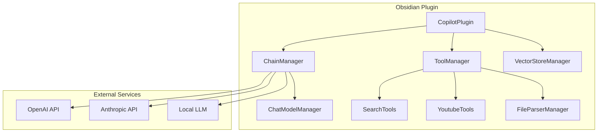
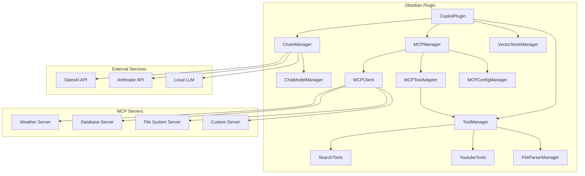
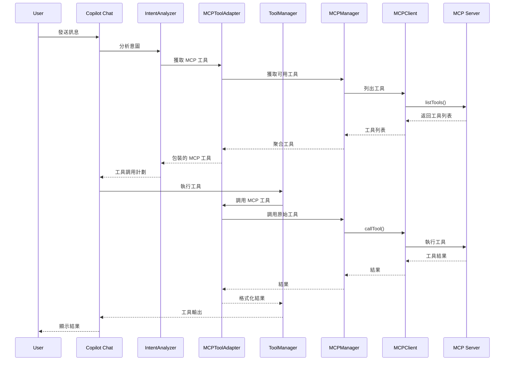
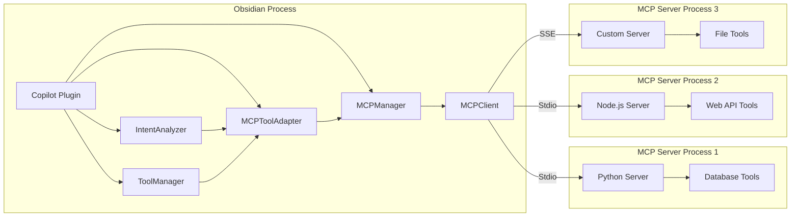

# Obsidian Copilot MCP 整合專案

## 專案概覽

為 Obsidian Copilot 插件添加 Model Context Protocol (MCP) 支援，使其能夠連接和使用 MCP servers，擴展工具生態系統。

## 專案資訊

- **專案根目錄**: /Users/jeff/Documents/code_repo/obsidian-copilot
- **當前工作目錄**: /Users/jeff/Documents/code_repo/obsidian-copilot
- **專案類型**: Obsidian Plugin Enhancement
- **主要語言**: TypeScript
- **目標**: 整合 MCP 協議到現有的 Obsidian Copilot 插件

## 技術棧

- **核心**: TypeScript, Obsidian Plugin API
- **前端**: React, Tailwind CSS, Radix UI
- **建構工具**: esbuild, npm
- **測試**: Jest
- **MCP SDK**: @modelcontextprotocol/sdk (TypeScript)
- **傳輸協議**: Stdio, SSE (Server-Sent Events)

## 系統架構

### 當前架構

### 目標架構 (加入 MCP)

## UI/UX 指南

- **設計語言**: 延續現有 Obsidian Copilot 設計
- **元件庫**: Radix UI + Tailwind CSS
- **顏色方案**: 遵循 Obsidian 主題系統
- **響應式**: 支援不同視窗大小
- **無障礙**: 遵循 WCAG 2.1 指南

## 資料庫架構

無需新增資料庫，使用 Obsidian 的設定系統儲存 MCP 配置。

## Mermaid 圖表

### MCP 整合流程圖

### MCP 連接架構圖

## 任務列表

### Foundation Tasks (基礎建設)

1. **Task 1: 專案設定和依賴安裝**

   - 狀態: COMPLETED
   - 描述: 安裝 MCP TypeScript SDK 和相關依賴
   - 依賴: 無
   - 完成標準: package.json 更新，依賴安裝完成
   - 完成日期: 2025/5/29

2. **Task 2: MCP 核心介面定義**
   - 狀態: COMPLETED
   - 描述: 定義 MCP 相關的 TypeScript 介面和類型
   - 依賴: Task 1
   - 完成標準: 類型定義檔案建立，涵蓋所有 MCP 概念
   - 完成日期: 2025/5/29

### MCP Infrastructure Tasks (MCP 基礎設施)

3. **Task 3: MCPClient 實作**

   - 狀態: COMPLETED
   - 描述: 實作 MCP 客戶端類別，處理伺服器連接和通訊
   - 依賴: Task 2
   - 完成標準: MCPClient 類別完成，支援 stdio 和 SSE 傳輸
   - 完成日期: 2025/5/29

4. **Task 4: MCPManager 實作**

   - 狀態: COMPLETED
   - 描述: 實作 MCP 管理器，負責管理多個 MCP 連接，支援多伺服器管理和統一的工具/資源接口
   - 依賴: Task 3
   - 完成標準: MCPManager 類別完成，支援多伺服器管理和統一接口
   - 完成日期: 2025/5/29

5. **Task 5: MCPToolAdapter 實作**
   - 狀態: COMPLETED
   - 描述: 建立 MCP 工具適配器，將 MCP 工具整合到現有工具系統，使 MCP 工具可在聊天中使用
   - 依賴: Task 4
   - 完成標準: 適配器完成，MCP 工具可在聊天中使用
   - 完成日期: 2025/5/29

### Configuration Tasks (設定系統)

6. **Task 6: MCP 設定資料模型**

   - 狀態: COMPLETED
   - 描述: 擴展設定系統以支援 MCP 伺服器配置
   - 依賴: Task 2
   - 完成標準: 設定模型更新，支援 MCP 伺服器列表
   - 完成日期: 2025/5/29

7. **Task 7: MCP 設定介面**
   - 狀態: TODO
   - 描述: 建立 MCP 伺服器管理的使用者介面
   - 依賴: Task 6
   - 完成標準: UI 元件完成，使用者可添加/編輯/刪除 MCP 伺服器

### Integration Tasks (整合)

8. **Task 8: 工具系統整合**

   - 狀態: TODO
   - 描述: 將 MCP 工具整合到現有的工具發現和執行系統
   - 依賴: Task 5
   - 完成標準: MCP 工具出現在工具列表，可正常執行

9. **Task 9: 聊天介面更新**
   - 狀態: TODO
   - 描述: 更新聊天介面以顯示 MCP 工具和資源
   - 依賴: Task 8
   - 完成標準: 聊天介面顯示 MCP 工具狀態和結果

### Testing Tasks (測試)

10. **Task 10: 單元測試**

    - 狀態: TODO
    - 描述: 為 MCP 相關功能編寫單元測試
    - 依賴: Task 9
    - 完成標準: 測試覆蓋率 >80%，所有測試通過

11. **Task 11: 整合測試**
    - 狀態: TODO
    - 描述: 測試與實際 MCP 伺服器的整合
    - 依賴: Task 10
    - 完成標準: 與多種 MCP 伺服器成功互動

### Documentation Tasks (文件)

12. **Task 12: 使用者文件**
    - 狀態: TODO
    - 描述: 編寫 MCP 功能的使用者指南
    - 依賴: Task 11
    - 完成標準: README 更新，包含 MCP 設定和使用說明

## 專案指南和規則

### 編碼規範

- 遵循現有的 ESLint 和 Prettier 配置
- 使用 TypeScript 嚴格模式
- 所有 public 方法必須有 JSDoc 註釋
- 錯誤處理使用統一的錯誤類型

### 安全考量

- MCP 伺服器連接需要使用者明確授權
- 限制 MCP 工具的檔案系統存取權限
- 記錄所有 MCP 操作以便審計

### 效能考量

- MCP 連接使用連接池管理
- 實作工具調用的超時機制
- 快取 MCP 工具和資源列表

### 版本控制

- 每個 task 完成後進行 commit
- commit 訊息格式: `[Task X]: 描述`
- 使用 feature branch 進行開發

## 完成標準

1. 使用者可以透過設定介面添加 MCP 伺服器
2. MCP 工具在聊天中正常運作
3. 支援 stdio 和 SSE 兩種傳輸協議
4. 完整的錯誤處理和使用者回饋
5. 符合 Obsidian 插件商店的發布標準

## 進度記錄

- 專案啟動日期: 2025/5/29
- 當前階段: 配置系統建設完成
- 下一個里程碑: 完成設定介面開發 (Task 7)
- MCP 核心組件完成: MCPClient, MCPManager, MCPToolAdapter 已實作並測試通過
- MCP 設定系統完成: 設定資料模型、伺服器管理 API、完整測試覆蓋
