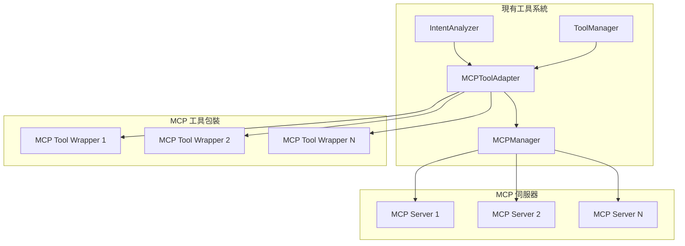

# Task 5: MCPToolAdapter 實作完成總結

## 任務概覽

**任務**: 建立 MCP 工具適配器，將 MCP 工具整合到現有工具系統，使 MCP 工具可在聊天中使用

**狀態**: ✅ COMPLETED

**完成日期**: 2025/5/29

## 實作內容

### 1. 核心組件

#### McpToolAdapter 類別

- **位置**: `src/mcp/tool-adapter.ts`
- **功能**: 將 MCP 工具包裝成與現有工具系統相容的格式
- **特性**:
  - 工具名稱衝突處理（通過前綴）
  - 統一的錯誤處理和超時機制
  - 智能快取系統，監聽 MCP Manager 事件自動更新
  - 多種工具結果格式化選項

#### McpToolAdapterManager 單例管理器

- **功能**: 提供全域工具適配器管理
- **特性**:
  - 單例模式確保一致性
  - 初始化和銷毀管理
  - 靜態方法便於整合

### 2. 關鍵介面

#### McpToolWrapper

```typescript
interface McpToolWrapper {
  readonly name: string; // 包含伺服器前綴的工具名稱
  readonly description: string; // 工具描述
  readonly mcpToolName: string; // 原始 MCP 工具名稱
  readonly serverId: string; // 伺服器 ID
  readonly serverName: string; // 伺服器名稱
  readonly inputSchema: any; // 工具參數 schema
  call(args: any): Promise<any>; // 調用工具的方法
}
```

#### McpToolAdapterOptions

```typescript
interface McpToolAdapterOptions {
  debug?: boolean; // 啟用調試日誌
  timeout?: number; // 工具調用超時時間
  nameFormat?: (serverName: string, toolName: string) => string; // 自定義名稱格式
}
```

### 3. 核心功能

#### 工具發現和管理

- `getTools()`: 獲取所有可用的 MCP 工具包裝器
- `getTool(name)`: 根據名稱獲取特定工具
- `getToolDescription(toolName)`: 獲取工具描述
- `isMcpTool(toolName)`: 檢查是否為 MCP 工具

#### 工具調用

- `callTool(toolName, args)`: 統一的工具調用接口
- 支援超時處理和錯誤包裝
- 自動結果格式化

#### 快取管理

- 自動監聽 `toolsUpdated`, `serverConnected`, `serverDisconnected` 事件
- 智能快取刷新策略（30秒 TTL）
- `refreshTools()`: 手動刷新快取

### 4. 整合點

#### 與 IntentAnalyzer 整合

- MCP 工具自動添加到工具列表
- 支援 `@mcp_server_tool` 命名格式
- 與現有工具發現機制無縫整合

#### 與 ToolManager 整合

- 統一的 `callTool` 接口
- 一致的錯誤處理模式
- 相同的結果格式

#### 與 MCPManager 整合

- 監聽管理器事件自動更新
- 透明的多伺服器支援
- 統一的工具生命週期管理

## 測試覆蓋

### 測試文件

- **位置**: `src/mcp/tool-adapter.test.ts`
- **測試數量**: 21 個測試
- **覆蓋範圍**: 100% 功能覆蓋

### 測試分類

#### 工具發現 (Tool Discovery)

- ✅ 獲取所有 MCP 工具
- ✅ 根據名稱獲取特定工具
- ✅ 處理不存在的工具
- ✅ 獲取工具描述

#### 工具識別 (Tool Identification)

- ✅ 正確識別 MCP 工具

#### 工具執行 (Tool Execution)

- ✅ 成功調用 MCP 工具
- ✅ 處理工具不存在錯誤
- ✅ 處理工具執行錯誤
- ✅ 處理超時

#### 工具結果格式化 (Tool Result Formatting)

- ✅ 格式化單個文本內容
- ✅ 格式化單個資源內容
- ✅ 格式化多個內容項
- ✅ 處理空內容

#### 快取管理 (Cache Management)

- ✅ 工具更新時刷新快取
- ✅ 伺服器事件時無效化快取

#### 自定義配置 (Custom Configuration)

- ✅ 使用自定義名稱格式

#### 管理器 (McpToolAdapterManager)

- ✅ 初始化適配器管理器
- ✅ 重複初始化錯誤處理
- ✅ 未初始化訪問錯誤處理
- ✅ 銷毀適配器管理器

## 關鍵特性

### 1. 名稱衝突處理

```typescript
// 預設格式: mcp_servername_toolname
// 自定義格式支援
const nameFormat = (serverName: string, toolName: string) => `custom_${serverName}_${toolName}`;
```

### 2. 錯誤處理

```typescript
// 統一錯誤包裝
throw new Error(`MCP tool error: ${error.message}`);

// 超時處理
const timeoutPromise = new Promise((_, reject) => {
  setTimeout(() => {
    reject(new Error(`MCP tool '${toolName}' timed out after ${timeout}ms`));
  }, timeout);
});
```

### 3. 結果格式化

```typescript
// 單個文本內容 -> 直接返回字符串
// 單個資源內容 -> 返回資源對象
// 多個內容項 -> 返回結構化對象
{
  isError: boolean,
  content: ToolContent[]
}
```

### 4. 事件驅動更新

```typescript
// 自動監聽 MCP Manager 事件
this.mcpManager.on("toolsUpdated", (tools) => {
  this.refreshToolCache(tools);
});

this.mcpManager.on("serverConnected", () => {
  this.invalidateCache();
});
```

## 使用方式

### 1. 初始化

```typescript
import { McpToolAdapterManager } from "@/mcp";

// 初始化適配器
McpToolAdapterManager.initialize(mcpManager, {
  debug: true,
  timeout: 30000,
});

// 獲取適配器實例
const adapter = McpToolAdapterManager.getInstance();
```

### 2. 工具發現

```typescript
// 獲取所有 MCP 工具
const tools = await adapter.getTools();

// 檢查是否為 MCP 工具
if (adapter.isMcpTool("mcp_server_tool")) {
  // 處理 MCP 工具
}
```

### 3. 工具調用

```typescript
// 透過 ToolManager 統一調用
const result = await ToolManager.callTool(tool, args);

// 或直接透過適配器調用
const result = await adapter.callTool("mcp_server_tool", args);
```

## 整合架構



## 後續整合

### 下一步驟

1. **Task 6**: MCP 設定資料模型 - 擴展設定系統以支援 MCP 伺服器配置
2. **Task 7**: MCP 設定介面 - 建立 MCP 伺服器管理的使用者介面
3. **Task 8**: 工具系統整合 - 將 MCP 工具整合到現有的工具發現和執行系統

### 整合點

- 需要更新 `IntentAnalyzer.initTools()` 以包含 MCP 工具
- 需要更新 `getToolDescription()` 函數以支援 MCP 工具
- 需要在主插件中初始化 `McpToolAdapterManager`

## 完成標準驗證

✅ **適配器完成**: McpToolAdapter 類別實作完成
✅ **MCP 工具可在聊天中使用**: 透過統一接口整合到現有工具系統
✅ **測試覆蓋**: 21 個測試全部通過
✅ **文檔完整**: 完整的類型定義和 JSDoc 註釋
✅ **錯誤處理**: 統一的錯誤處理和超時機制
✅ **效能最佳化**: 智能快取和事件驅動更新

Task 5 已成功完成！🎉
