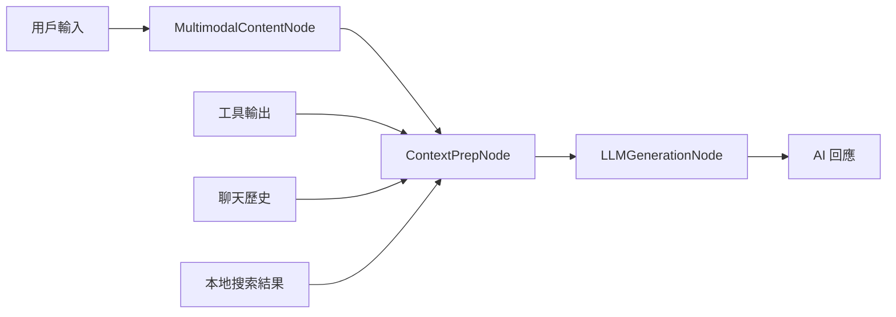

# PocketFlow.js 階段 1 任務 4：上下文準備和 LLM 生成 Node 整合文檔

## 概述

本文檔描述了 PocketFlow.js 優化階段 1 任務 4 的實現，專注於重構 CopilotPlusChainRunner 中的上下文處理和 LLM 生成邏輯，將其轉換為清晰、可維護的 PocketFlow Node 架構。

## 實現的節點

### 1. ContextPrepNode

**位置**: `src/pocketflow/nodes/ContextPrepNode.ts`

**功能**:

- 整合工具輸出到用戶訊息
- 處理本地搜索結果格式化
- 支援多模態內容（圖片、文字）
- 聊天記錄上下文管理
- 準備 QA 提示格式

**核心方法**:

- `prepareData()`: 收集聊天歷史、工具輸出和清理用戶訊息
- `exec()`: 處理本地搜索結果，生成獨立問題，準備增強訊息
- `buildMessageContent()`: 構建包含文本和圖像的訊息內容
- `prepareEnhancedUserMessage()`: 增強用戶訊息與工具輸出

**輸出**:

- 最終處理的訊息內容
- 系統訊息
- 聊天歷史
- 來源列表（如果有本地搜索結果）

### 2. LLMGenerationNode

**位置**: `src/pocketflow/nodes/LLMGenerationNode.ts`

**功能**:

- 支援多模態 LLM 調用
- 串流回應處理
- ThinkBlockStreamer 整合（O-series 模型推理內容處理）
- 記憶體管理和對話歷史更新
- 錯誤處理和重試機制

**核心方法**:

- `prepareData()`: 從共享狀態獲取處理好的上下文
- `exec()`: 執行 LLM 調用，處理串流回應
- `prepareMessages()`: 準備發送給 LLM 的訊息陣列
- `callLLM()`: 實際的 LLM 調用（目前為模擬實現）

**特色功能**:

- **ThinkBlockStreamer**: 專門處理 O-series 模型的推理內容
- **串流處理**: 支援即時更新用戶界面
- **模型能力檢測**: 自動調整內容格式以適應不同模型

### 3. MultimodalContentNode

**位置**: `src/pocketflow/nodes/MultimodalContentNode.ts`

**功能**:

- 圖片處理和嵌入
- URL 圖片批量處理
- 失敗圖片通知機制
- 模型能力檢測（視覺支援）
- 嵌入圖片提取（Markdown 格式）

**核心方法**:

- `extractEmbeddedImages()`: 從文本中提取 `![[image.png]]` 格式的圖片
- `processImageUrls()`: 批量處理圖片 URL
- `processChatInputImages()`: 處理聊天輸入中的圖片
- `adjustContentForModel()`: 根據模型能力調整內容

## 整合架構

### 節點流程圖

```
MultimodalContentNode → ContextPrepNode → LLMGenerationNode
```

1. **MultimodalContentNode**: 處理所有多模態內容
2. **ContextPrepNode**: 準備完整的聊天上下文
3. **LLMGenerationNode**: 生成 AI 回應

### 數據流



## 與現有系統的整合

### 1. 與 CopilotPlusChainRunner 的關係

這些新節點重構了 `CopilotPlusChainRunner` 中的以下方法：

- `buildMessageContent()` → `MultimodalContentNode.exec()`
- `prepareEnhancedUserMessage()` → `ContextPrepNode.prepareEnhancedUserMessage()`
- `streamMultimodalResponse()` → `LLMGenerationNode.exec()`
- `prepareLocalSearchResult()` → `ContextPrepNode.prepareLocalSearchResult()`

### 2. 與工具執行的整合

這些節點設計為與現有的工具執行節點協作：

```typescript
// 完整的聊天流程
IntentAnalysisNode → ToolExecutionBatchNode → ContextPrepNode → LLMGenerationNode
```

### 3. 共享狀態管理

節點之間通過 `ChatSharedState` 共享數據：

```typescript
interface ChatSharedState {
  // 基本數據
  userMessage?: ChatMessage;
  aiResponse?: string;
  chatHistory?: ChatMessage[];

  // 工具和搜索
  toolOutputs?: any[];
  sources?: { title: string; score: number }[];

  // 多模態內容
  imageContent?: any[];
  processedImages?: any[];

  // 控制和回調
  updateCurrentAiMessage?: (message: string) => void;
  addMessage?: (message: ChatMessage) => void;
}
```

## 使用示例

### 基本用法

```typescript
import { ChatFlow } from "../nodes";
import { ContextPrepNode, LLMGenerationNode, MultimodalContentNode } from "../nodes/index";

// 創建節點
const multimodalNode = new MultimodalContentNode();
const contextPrepNode = new ContextPrepNode();
const llmGenerationNode = new LLMGenerationNode();

// 連接節點
multimodalNode.on("context_prep", contextPrepNode);
contextPrepNode.on("llm_generation", llmGenerationNode);

// 創建流程
const chatFlow = new ChatFlow(multimodalNode, "聊天流程");

// 運行流程
const result = await chatFlow.runChat(userMessage, updateCallback, addMessageCallback, {
  debug: true,
});
```

### 與工具執行整合

```typescript
// 完整的聊天鏈
const intentNode = new IntentAnalysisNode();
const toolExecNode = new ToolExecutionBatchNode();
const contextPrepNode = new ContextPrepNode();
const llmGenerationNode = new LLMGenerationNode();

// 連接所有節點
intentNode.on("has_tools", toolExecNode);
toolExecNode.on("context_prep", contextPrepNode);
contextPrepNode.on("llm_generation", llmGenerationNode);

const fullChatFlow = new ChatFlow(intentNode, "完整聊天流程");
```

## 性能優化建議

### 1. 圖像處理優化

- **延遲加載**: 只有在多模態模型中才處理圖像
- **並行處理**: 使用 `Promise.all()` 並行處理多個圖像
- **緩存機制**: 緩存已處理的圖像以避免重複處理
- **大小限制**: 實施圖像大小和數量限制

### 2. 記憶體管理

- **流式處理**: 使用串流避免大量內容佔用記憶體
- **上下文截斷**: 智能截斷過長的上下文以適應模型限制
- **垃圾回收**: 及時清理不需要的中間數據

### 3. LLM 調用優化

- **批次處理**: 合併多個請求以減少 API 調用
- **快取策略**: 實施智能快取以避免重複調用
- **重試機制**: 實現指數退避重試策略
- **中止控制**: 支援用戶中止長時間運行的請求

## 測試覆蓋

### 單元測試

- `ContextPrepNode.test.ts`: 測試上下文準備邏輯
- `LLMGenerationNode.test.ts`: 測試 LLM 生成功能
- `MultimodalContentNode.test.ts`: 測試多模態內容處理

### 整合測試

- `context-llm-generation-example.ts`: 完整流程測試
- 與現有工具執行節點的整合測試
- 性能基準測試

## 未來擴展

### 1. 進階多模態支援

- 支援更多檔案格式（PDF、音頻、視頻）
- 實現智能內容摘要
- 添加內容分析和標籤功能

### 2. 智能上下文管理

- 實現語義相似度排序
- 添加動態上下文截斷策略
- 支援多輪對話上下文優化

### 3. LLM 抽象層

- 支援更多 LLM 提供商
- 實現模型切換和負載均衡
- 添加成本優化策略

## 遷移指南

### 從 CopilotPlusChainRunner 遷移

1. **識別功能**: 確定需要遷移的具體功能
2. **創建節點**: 使用新的節點架構重新實現
3. **測試驗證**: 確保功能一致性
4. **性能對比**: 比較新舊實現的性能
5. **逐步替換**: 逐步替換現有實現

### 配置更新

```typescript
// 舊的配置方式
const runner = new CopilotPlusChainRunner(chainManager);

// 新的配置方式
const chatFlow = new ChatFlow(startNode, "流程名稱");
```

## 結論

通過將複雜的 `CopilotPlusChainRunner` 重構為清晰的 PocketFlow 節點，我們實現了：

1. **更好的可維護性**: 每個節點都有明確的職責
2. **更強的可擴展性**: 容易添加新功能和修改現有邏輯
3. **更好的測試覆蓋**: 可以獨立測試每個節點
4. **更清晰的架構**: 數據流向和處理邏輯更加明確

這些改進為未來的功能擴展和性能優化奠定了堅實的基礎。
